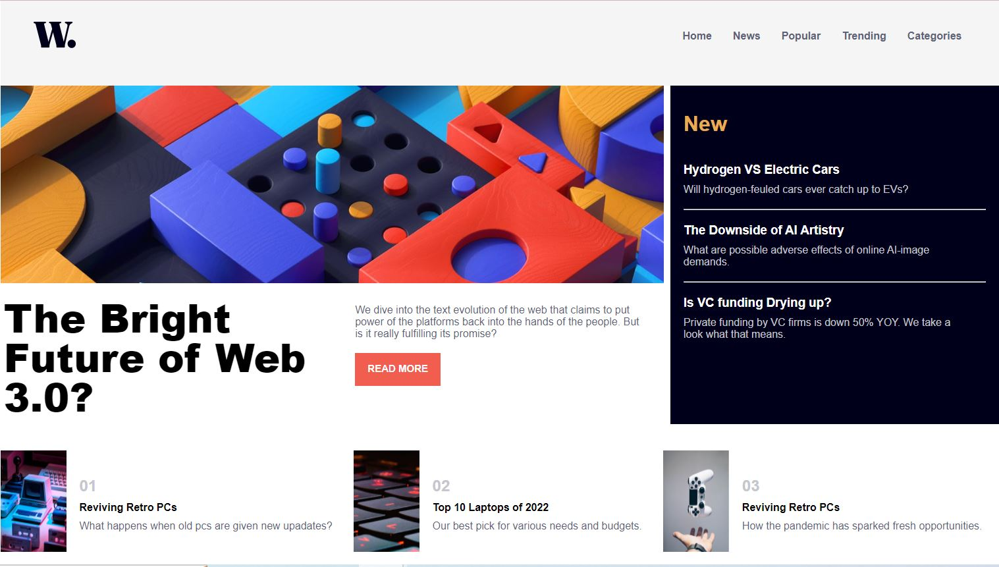
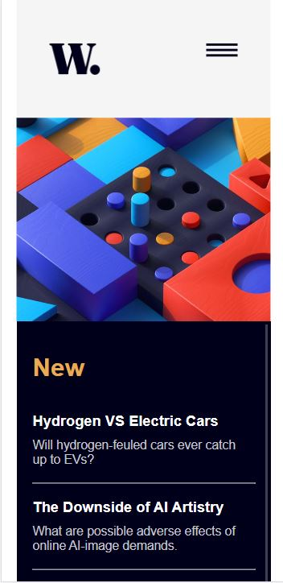

# News Homepage Challenge

This project is a solution to the [News Homepage Challenge](https://www.frontendmentor.io/challenges/news-homepage-H6SWTa1MFl) from Frontend Mentor. It is a simple news homepage built using HTML, CSS, and JavaScript.

#### Web Design Preview


#### Mobile Design Preview


You can view the live project here: [News Homepage](https://mehwishjbe.github.io/news-homepage/)

## Table of Contents

- [Overview](#overview)
- [Features](#features)
- [Technologies Used](#technologies-used)
- [Project Structure](#project-structure)
- [Getting Started](#getting-started)

## Overview

This project is a front-end web development challenge where I had to create a news homepage according to the provided design. It's a single web page.

## Features

- Responsive design for mobile screens.
- Display menu on mobile version by clicking on hamburger image.

## Technologies Used

- HTML
- CSS
- JavaScript

## Project Structure

The project structure is organized as follows:
- `html/` : The main HTML file for the project (`index.html`).
- `css/`: Contains the compiled CSS file (`main.css`).
- `js/`: Contains the JavaScript code for the project (`main.js`).
- `images/`: A directory containing image assets used in the project.

## Getting Started

To run this project locally, follow these steps:

1. Clone the repository:

   ```bash
   git clone https://github.com/mehwishjbe/news-homepage.git
